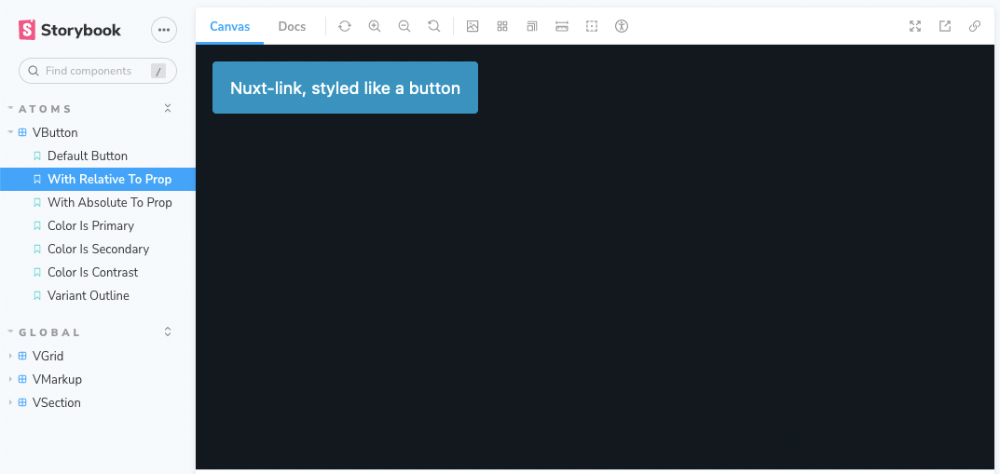

# Chia - Nuxt 3 Layer

> ⚠️ This package is experimental.


## [Nuxt 3](https://nuxt.com/), [Storybook (Vite)](https://storybook.js.org/docs/vue/builders/vite), [Vitest](https://vitest.dev/), [Pico CSS](https://picocss.com/) starter layer.

Check out the [Nuxt 3 documentation](https://nuxt.com/docs/getting-started/layers) to learn more about Nuxt Layers.

## Features

- [x] 🎨 Pico.css minimal CSS framework
- [x] 📚 Storybook
- [x] 🏗️ 4 Starter components (`c-grid`, `c-section`, `c-markup`, `c-button`), with stories and unit tests
- [x] 💚 Vite-friendly
- [x] 😎 BYO everything else!
- [x] ✨ `pnpm` by default

## Usage `@TODO: This part of the docs incomplete.`

Install the package and its dependecy

```
pnpm add @picocss/pico
```

Extend the package in your Nuxt config with the `extends` keyword.

```ts
// nuxt.config.ts
export default defineNuxtConfig({
  extends: 'github:miclgael/chia'
})
```

You now have access to tested components and a very simple pre-configured Nuxt theme. 

## Screenshots



## Contributing

Make sure to install the dependencies:

```bash
pnpm install --shamefully-hoist
```

## Development Server

Start the development server on http://localhost:3000

```bash
pnpm run dev
```

## Production

Early days for Nuxt 3, so please make sure the application _builds_ before pushing:

```bash
pnpm run build
```

Locally preview production build:

```bash
pnpm run preview
```

Checkout the [deployment documentation](https://v3.nuxtjs.org/guide/deploy/presets) for more information.

## Storybook

To work on components in isolation using Storybook:

```bash
pnpm run storybook
```

## Testing

Run tests with [Vitest](https://vitest.dev/api/) and [Vue test utils](https://test-utils.vuejs.org/)

```bash
pnpm run test
```

That's it!
